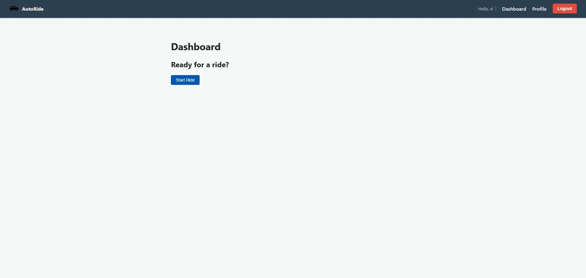
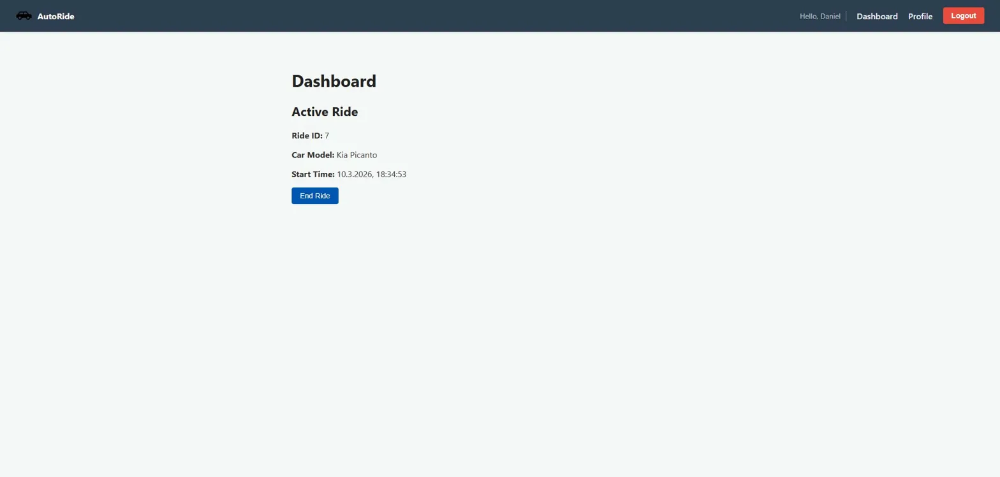
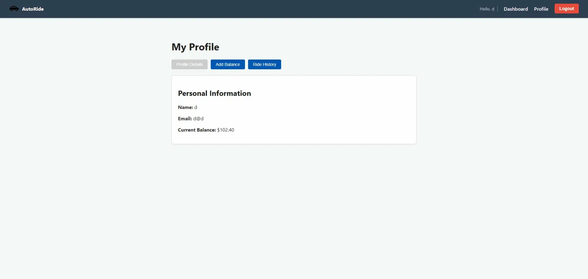

# AutoRide

A full-stack car-sharing web application built with Spring Boot and React.
Users can locate the nearest available car, start a ride using geolocation, and pay based on the total ride duration.

## Screenshots





## Tech Stack
* **Backend:** Java 17, Spring Boot 3.4, Spring Security, JWT, JPA/Hibernate, Flyway, PostgreSQL
* **Frontend:** React 19, TypeScript, Vite, React Router
* **Infrastructure:** Docker, Docker Compose, Nginx

## Features
* User registration and login with JWT authentication.
* Find the closest available car using the Haversine distance formula.
* Start and end rides with automatic geolocation (manual fallback supported).
* Real-time balance deduction based on ride duration.
* Ride history per user.
* Optimistic locking to prevent race conditions on car booking.

## Getting Started

### Prerequisites
* Docker and Docker Compose installed.

### Setup
1. Clone the repository:
   ```bash
   git clone https://github.com/DanielOhana8/AutoRide-web.git
   cd AutoRide-web
   ```

2. Create a `.env` file in the root directory:
   ```bash
   cp .env.example .env
   ```

3. Fill in your environment variables in the `.env` file:
   ```properties
   JWT_SECRET=your-256-bit-hex-secret
   POSTGRES_PASSWORD=your-db-password
   ```
   *Note: To generate a secure JWT secret, you can run `openssl rand -hex 32`.*

4. Start the application:
   ```bash
   docker compose up --build
   ```

5. Access the application:
    * Frontend: http://localhost
    * API: http://localhost:8080/api
    * Swagger UI: http://localhost:8080/swagger-ui.html

## API Overview

| Method | Endpoint                        | Description                       |
|--------|---------------------------------|-----------------------------------|
| POST   | `/api/auth/register`            | Register a new user               |
| POST   | `/api/auth/login`               | Login and receive JWT             |
| GET    | `/api/users/me`                 | Get current user info             |
| PATCH  | `/api/users/balance`            | Add funds to balance              |
| PATCH  | `/api/users/location`           | Update user location              |
| GET    | `/api/cars/closest`             | Find closest available car        |
| GET    | `/api/cars/{id}`                | Get car by ID                     |
| PATCH  | `/api/cars/{id}/available`      | Update car availability status    |
| PATCH  | `/api/cars/{id}/location`       | Update car location               |
| POST   | `/api/rides/start`              | Start a ride                      |
| PATCH  | `/api/rides/end`                | End a ride                        |
| GET    | `/api/rides`                    | Get all rides history             |
| GET    | `/api/rides/active`             | Get all active rides              |
| GET    | `/api/rides/user`               | Get user's ride history           |
| GET    | `/api/rides/user/active`        | Get user's active ride            |
| GET    | `/api/rides/car/{carId}`        | Get car's ride history            |
| GET    | `/api/rides/car/{carId}/active` | Get car's active ride             |

## Project Structure
```text
AutoRide-web/
├── backend/
│   └── src/main/java/com/autoride/
│       ├── config/
│       ├── controller/
│       ├── dto/
│       ├── entity/
│       ├── exception/
│       ├── repository/
│       ├── security/
│       └── service/
├── frontend/
│   └── src/
│       ├── components/
│       ├── context/
│       ├── services/
│       └── types/
├── docker-compose.yml
├── .env.example
└── README.md
```

## Development (without Docker)

### Backend
Navigate to the backend directory and configure your local application properties:
```bash
cd backend
cp src/main/resources/application.properties.example src/main/resources/application.properties
```
Fill in your local database and JWT configuration, then run:
```bash
./mvnw spring-boot:run
```

### Frontend
Navigate to the frontend directory, install dependencies, and start the development server:
```bash
cd frontend
npm install
npm run dev
```
The development server will run at http://localhost:5173.

## Notes
* **Initial Balance:** New users start with a $0 balance. Funds must be added via the Profile page before starting a ride.
* **Database Seeding:** The application automatically seeds 3 cars in the Tel Aviv area on the first run using a Flyway migration.
* **Geolocation:** Geolocation is required to start and end a ride. A manual coordinate input fallback is provided.